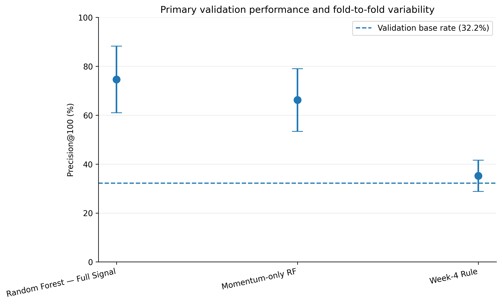
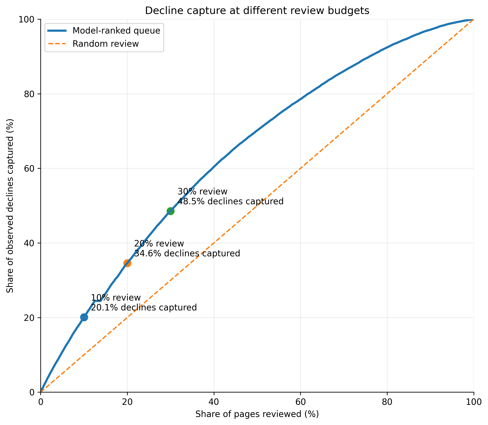
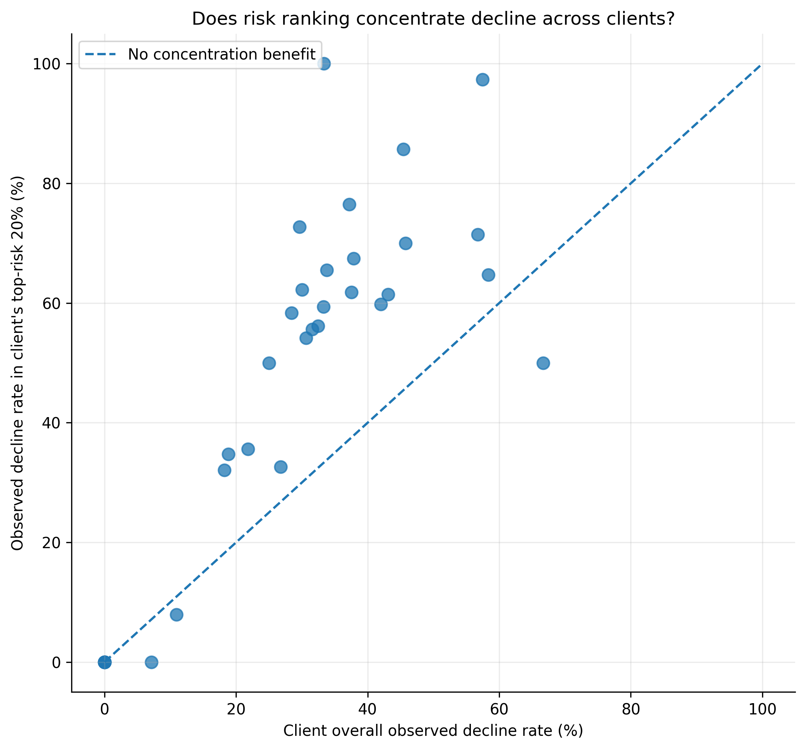
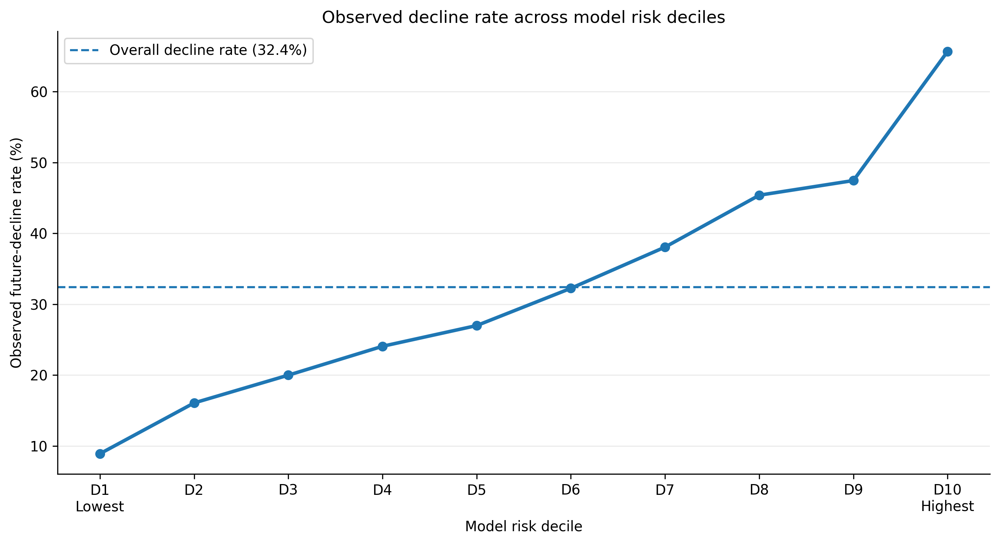
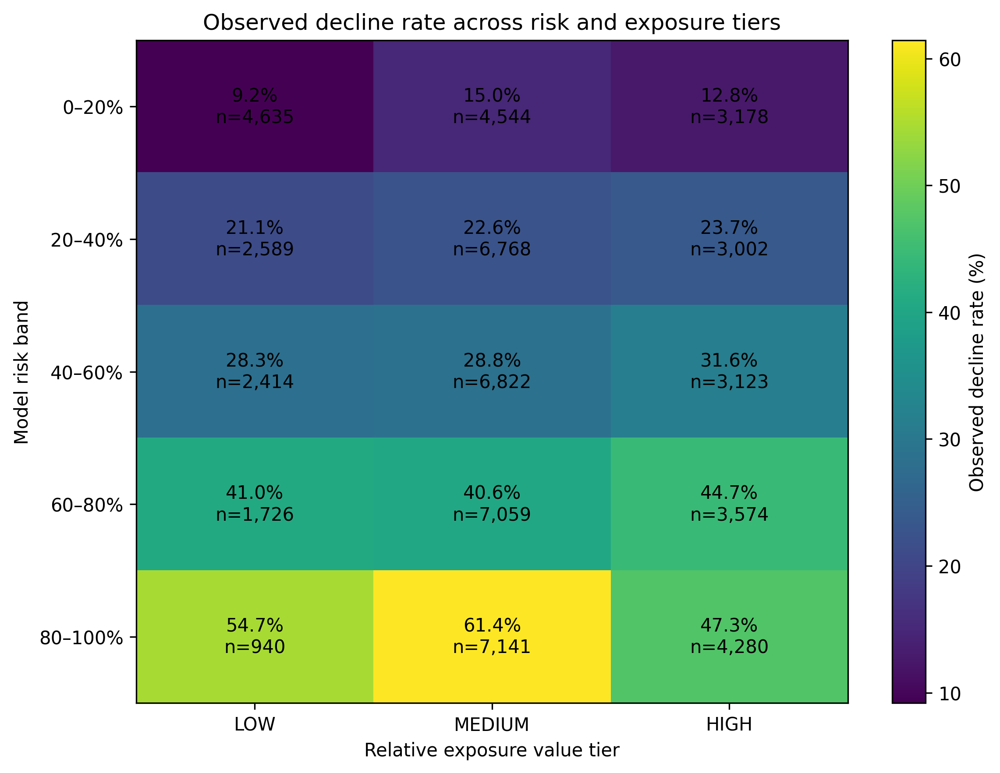

# Which Pages Should Be Reviewed First?
## Ranking Future Search-Impression Decline Risk Across Unseen Clients

**Author:** Dania Yasir  
**Project:** FlyRank ML Internship Capstone  
**Status:** Final research-paper manuscript  

> This manuscript is the polished research-paper source. The current repository is the source of truth for final metrics and methodology.

---

## Abstract

Large content portfolios create a prioritization problem: when analyst capacity is limited, which pages should be reviewed first for possible future search-performance decline? Using the FlyRank ML Internship warehouse, this study evaluates **61,795 pseudonymized pages across 34 clients**, with March 1–15, 2026 used for features and March 16–31 used to define a future-impression-decline proxy. The task is framed as ranking, using a **21-feature Random Forest** and comparing it with both a transparent Week-4 rule and a momentum-only Random Forest under **5-fold client-disjoint validation**. The Full-Signal model achieved **74.6% mean Precision@100 (SD 13.6%)**, compared with **66.2%** for the momentum-only model and **35.2%** for the rule baseline; a random-row diagnostic reached **90.0%**, showing that non-grouped validation was materially optimistic. These results support a **human-in-the-loop review queue** for prioritizing investigation, not automatic content changes, causal claims, or prediction of Google's ranking algorithm.

---

## 1. Introduction

Large content portfolios can contain far more pages than an analyst can inspect regularly. In that setting, the useful machine-learning question is not simply whether a page can be classified as declining or not declining. The practical question is **which pages should be reviewed first when review capacity is limited**.

This study asks:

> **Can search-performance signals available in the first half of a month help prioritize which content pages should be reviewed first for possible future decline?**

**Central thesis.** Search-performance signals available before the outcome window can support a useful ranking of future decline risk across unseen clients, but credible evidence depends on client-disjoint evaluation, and the output should be used to prioritize human review rather than trigger automatic content changes.

The task is therefore framed as a **ranking problem**. Each eligible page receives a risk score, and pages with higher scores are placed earlier in a review queue. The unit of analysis is one pseudonymized content page within one pseudonymized client.

The intended use is deliberately narrow. The model does not decide whether a page should be rewritten, refreshed, deleted, redirected, or published. It also does not attempt to predict Google's ranking algorithm or establish why a page declined. Its role is decision support:

**Model prioritizes → human investigates → human decides.**

The study contributes three practical elements. First, it tests a ranking formulation that matches limited analyst capacity. Second, it evaluates the model under client-disjoint validation so that pages from the same client do not appear in both training and validation. Third, it converts model risk into a human-review playbook rather than an automatic editing workflow.

---

## 2. Related Work and Evaluation Context

This study is an applied ranking project rather than a proposal for a new machine-learning algorithm. The relevant research context is therefore methodological: how to evaluate structured-data models under distribution shift, how to align evaluation with limited review capacity, and how to inspect errors beyond one aggregate score.

Recent work on tabular learning under temporal shift shows that the training and validation protocol can materially change model selection and measured generalization, making split design part of the research claim rather than a minor implementation detail [1]. Broader tabular distribution-shift benchmarks also show that performance can change when the evaluation distribution differs from the training distribution [2]. These studies do not prescribe the client split used here, but they support the broader principle that evaluation should reflect the shift expected at use time. In this project, that means holding out complete clients rather than relying on random-row cross-validation.

Work on decision-aware Top-K selection studies settings in which decision makers can act on only a limited number of ranked items [3]. This project does not use that paper's model or objective, but the decision setting is closely related: the practical value of the model depends on whether observed decline cases are concentrated near the top of a queue that a human can realistically review.

Finally, recent error-profiling work emphasizes examining where models fail and how errors vary across subpopulations, rather than relying only on one overall performance number [4]. That perspective motivates the client-level and error analyses reported here.

## 3. Data and Cohort Construction

The analysis uses the approved **FlyRank ML Internship warehouse release, build `v20260703`**, accessed through DuckDB and Hugging Face. The main table is `fact_content_daily_performance`.

The full warehouse contains approximately **78.8 million daily performance rows**, but the final experiment uses only the **March 2026** partition. After March aggregation, the study starts with **331,437 page-level candidates**. Of these, **68,288** have complete Google Search Console coverage for the March 1–15 feature window, and **61,795** also have complete coverage for the March 16–31 outcome window. The final modeling cohort spans **34 pseudonymized clients**.

### 3.1 Analysis windows

- **Feature window:** March 1–15, 2026
- **Outcome window:** March 16–31, 2026
- **Final modeling cohort:** 61,795 pages
- **Clients:** 34
- **Observed decline rate:** 32.4%

The warehouse size and the modeling cohort should not be conflated. The model is not trained directly on all 78.8 million warehouse rows. Those rows describe the underlying daily-performance warehouse; the final experiment evaluates 61,795 March page-level examples after aggregation and coverage filtering.

### 3.2 Information boundary and exclusions

Only information available by the end of March 15 is permitted as model input. The following are excluded from the model feature set:

- `client_id`
- `content_id`
- future-window impression fields
- future average daily impressions
- `impression_change_pct`
- `is_declining_proxy`
- any field derived from the outcome window

Client and content IDs are used only for grouping, joining, and validation. Public outputs use pseudonymized data only and do not include client names, URLs, private queries, or access credentials.

The coverage filter is a real limitation. Results apply to pages with complete search-data coverage across the required windows and should not automatically be generalized to every page in the warehouse.

---

## 4. Prediction Task and Label

The prediction boundary is the end of **March 15, 2026**. Features are computed from March 1–15 only. March 16–31 is hidden from the model and used only to define the evaluation target.

A page is labeled as a future decline case when its average daily impressions during March 16–31 are more than **20% lower** than its average daily impressions during March 1–15.

In compact form:

`future average daily impressions < 0.80 × first-half average daily impressions`

This target is a **future-impression-decline proxy**. It is useful for ranking evaluation, but it is not a universal definition of content quality, content decay, or whether a page needs a refresh. It also does not measure the causal effect of any intervention.

---

## 5. Methodology

### 5.1 Feature design

The final model uses **21 pre-outcome features** grouped into four categories.

| Feature group | Count | Purpose |
|---|---:|---|
| Momentum anchors | 2 | Capture recent impression movement |
| Current performance level | 5 | Represent traffic, clicks, CTR, position, and activity |
| Trend shape | 10 | Capture short-window changes, acceleration, and trajectory |
| Client-relative context | 4 | Compare a page with other pages from the same client |

The two momentum anchors are `imp_momentum_pct` and `imp_momentum_log`.

Current-performance features include first-half impressions, clicks, CTR, average position, and active rate. Trend-shape features include two 5-day impression step changes, acceleration, number of declining steps, recent-vs-prior impression movement, click movement, CTR movement, position movement, activity movement, and position-shape availability. Client-context features are within-client percentiles for traffic level, CTR, position, and recent-vs-prior impression trend.

All features are computed from pre-outcome information only.

### 5.2 Week-4 rule baseline

The transparent Week-4 baseline prioritizes a page when:

1. average first-half search position is **20 or better**; and
2. CTR is low relative to pages in the same search-position bucket.

The position buckets are Top 3, 4–10, 11–20, 21–50, and 50+. Matching pages are ranked by first-half impressions so that more visible opportunities appear earlier.

The rule was informed by an earlier signal audit. Search volume alone did not show a monotonic relationship with future decline, while low CTR was more informative when interpreted relative to search position, particularly among pages already ranking in the Top 20. This motivated a position-aware baseline rather than a generic low-CTR or high-volume rule.

The original Week-4 full-queue result was **39.0% Precision@100**. That value is retained only as historical context. For the final model comparison, the same rule is re-evaluated inside the same held-out client folds as the learned models. Under that fair design, the Week-4 baseline achieves **35.2% mean Precision@100 (SD 6.4%)**.

### 5.3 Models

The primary model is a **Random Forest classifier** using the full 21-feature set.

Final settings:

- `n_estimators=200`
- `max_depth=10`
- `min_samples_leaf=25`
- `max_features="sqrt"`
- `class_weight="balanced_subsample"`
- `random_state=42`

A second **momentum-only Random Forest** uses only the two momentum anchors. This is a stronger comparison than the simple rule baseline because it tests whether the additional 19 context and trend-shape features add ranking value beyond recent impression movement alone.

### 5.4 Validation design

The final evaluation uses **5-fold client-disjoint grouped validation**. Complete clients are held out from training, so pages from the same client do not appear in both training and validation within a fold.

This choice follows an important validation finding. The same Full-Signal Random Forest achieved **90.0% mean Precision@100 (SD 1.9%)** under random-row cross-validation, but only **74.6% (SD 13.6%)** under client-disjoint validation. The difference is **15.4 percentage points**.

On average, about **29.6 clients** appeared on both the training and validation sides of the random-row split. That setting allows the model to benefit from client-specific patterns it has already seen. The lower client-disjoint result is therefore treated as the more credible estimate for the intended cross-client use case.

### 5.5 Evaluation metric

The primary metric is **Precision@100**: the share of actual decline cases among the first 100 pages in the ranked validation queue. It was chosen because the intended use is prioritization under limited review capacity rather than classification of every page in the portfolio. The value of `K=100` represents a fixed top-of-queue review budget used consistently across the compared methods.

### 5.6 Leakage audit

The final 21-feature set was audited against the prediction boundary. The audit found:

- forbidden feature overlap: none
- suspicious future/outcome/target-named features: none
- missing values in final model features: 0

Client-relative percentile features are also computed from pre-outcome data before filtering pages on future coverage.

---

## 6. Results

### 6.1 Honest model comparison

All primary methods below are evaluated on the same target, the same five client-disjoint folds, and the same `Precision@100` metric.

| Method | Mean Precision@100 | SD |
|---|---:|---:|
| Random Forest — Full Signal | **74.6%** | 13.6% |
| Random Forest — Momentum Only | **66.2%** | 12.8% |
| Week-4 Rule Baseline | **35.2%** | 6.4% |

For context, **32.4%** of eligible pages in the final cohort meet the decline proxy overall. The Full-Signal model therefore concentrates substantially more observed decline cases in its top 100 selections than are present in the eligible population as a whole.

The full model improves mean Precision@100 by **39.4 percentage points** over the Week-4 rule under the fair same-fold comparison.

The more demanding comparison is against the momentum-only Random Forest. Here, the full model improves Precision@100 by **8.4 percentage points**. This smaller gap suggests that recent momentum carries a large share of the ranking signal, while the additional trend-shape, traffic, CTR, position, and client-relative features provide useful incremental information.

**Takeaway:** The full model produced the strongest observed client-disjoint Precision@100. The smaller gap to the momentum-only Random Forest shows that recent momentum is already a strong signal and that the added feature groups provide a smaller, directional improvement.

### 6.2 What does the ranking buy when review capacity is limited?

The final out-of-fold queue contains **61,795 pages**. When review capacity is limited, the model concentrates observed decline cases near the top of the queue:

- reviewing the top **10%** captures **20.1%** of observed decline cases;
- reviewing the top **20%** captures **34.6%**;
- reviewing the top **30%** captures **48.5%**.

**Takeaway:** The ranking places a disproportionate share of observed decline cases earlier in the queue, which is the intended operational benefit when analysts cannot review every page.

### 6.3 Client generalization

Client-disjoint evaluation makes heterogeneity visible. In the final action-playbook summary, **24 of 34 clients** show positive concentration of decline among their high-risk pages. The **median client uplift is +18.1 percentage points**, where uplift is the decline rate among a client's high-risk pages minus that client's overall decline rate.

A separate **macro-client Precision@10** check shows the same directional ordering while giving each eligible client equal weight: **69.2%** for the Full-Signal Random Forest, **58.8%** for the Momentum-Only Random Forest, and **38.8%** for the Week-4 rule. This metric is reported separately from Precision@100 because it answers a different question and should not be numerically combined with the pooled fold-level estimate.

**Takeaway:** Risk concentration is positive for most, but not all, evaluated clients. The result supports decision support rather than a claim of uniform performance.

### 6.4 Risk separation

The observed decline rate increases substantially across model-risk levels. The lowest-risk decile has an observed decline rate of approximately **9.1%**, compared with **32.4%** for the overall cohort and **65.1%** for the highest-risk decile.

**Takeaway:** Higher model scores correspond to a much denser concentration of observed future-decline cases, without implying that the score identifies the cause of decline.

---

## 7. Error Analysis

A ranking metric alone does not explain where the model fails. Qualitative out-of-fold error analysis from model development helps define the boundary of the prediction problem.

### 7.1 High-ranked false positives

Many high-ranked false positives already showed strong decline-like patterns by March 15, including large negative impression momentum, repeated declining 5-day steps, or worsening search position. They looked risky at the prediction boundary but did not cross the later -20% decline threshold.

Possible explanations include temporary volatility, partial recovery during the outcome window, or a warning pattern that did not persist long enough to satisfy the label.

### 7.2 Low-ranked true declines

Some missed decline cases showed flat or positive first-half momentum, no clear sequence of declining steps, and sometimes improving search position before the outcome window.

These cases are structurally difficult. A later reversal is hard to rank correctly when little warning is visible in the permitted feature window.

Feature importance is used only as a model-behavior sanity check. It should not be interpreted as evidence that any feature causes future decline.

---

## 8. From Risk Score to Human Action

The final model output is converted into a ranked human-review queue. The operating policy uses within-fold risk percentile:

- **Risk percentile ≥ 0.80:** active human review
- **0.50 ≤ risk percentile < 0.80:** watchlist
- **Risk percentile < 0.50:** monitor

For high-risk pages, observable pre-outcome signals determine the recommended review type.

| Observed pattern | Recommended human review |
|---|---|
| Sustained decline pattern | `CONTENT_REFRESH_REVIEW` |
| Ranking slippage | `SERP_AND_INTENT_REVIEW` |
| Visible page with relatively low CTR | `TITLE_META_CTR_REVIEW` |
| Client-relative anomaly | `MANUAL_DIAGNOSTIC_REVIEW` |
| High risk without a clear heuristic explanation | `HUMAN_REVIEW_BEFORE_EDIT` |
| Medium risk | `WATCHLIST_NO_IMMEDIATE_EDIT` |
| Lower risk | `MONITOR_NO_IMMEDIATE_EDIT` |

These recommendations are investigation priorities, not editing instructions. For example, `CONTENT_REFRESH_REVIEW` means that an analyst should investigate whether a refresh may be appropriate. It does not mean that the page should be automatically rewritten.

The second axis in this matrix represents **relative first-half impression exposure within a client**. It is an operational visibility signal, not revenue, ROI, or financial value.

**Takeaway:** Model risk determines review priority, while observable context helps decide what kind of human investigation may be useful.

**Operating principle: Model prioritizes → human investigates → human decides.**

---

## 9. Limitations

This study has several important limitations.

First, the target is a **future-impression-decline proxy**. It does not measure content quality and does not show whether a refresh or other intervention would causally improve performance.

Second, **March 2026 is the single primary evaluation month**. Performance may change over time, and no completed temporal holdout is part of the final evidence used in this manuscript.

Third, the final cohort contains **34 clients** with unequal page counts and different outcome prevalence. Client-disjoint validation reduces client leakage but does not eliminate client heterogeneity.

Fourth, fold-level variability remains substantial: the Full-Signal Random Forest achieved **74.6% mean Precision@100 with a 13.6% standard deviation**.

Fifth, client-relative features depend on current portfolio context. A scoring process needs enough same-client pages to compute those relative signals consistently.

Finally, the model identifies statistical patterns in pre-outcome search-performance data. It does **not** predict Google's ranking algorithm, establish why a page declined, or prove that changing a high-risk page will improve later performance.

Temporal validation, prospective monitoring, and eventually intervention-aware evaluation would be needed before stronger production claims.

---

## 10. Conclusion

This study shows that pre-outcome search-performance signals can support a useful ranking of pages for future-decline review, but the credibility of that result depends heavily on how validation is designed. Under the primary client-disjoint evaluation, the Full-Signal Random Forest achieved **74.6% mean Precision@100**, materially above the **35.2%** Week-4 rule and directionally above the **66.2%** momentum-only Random Forest.

The project therefore supports two conclusions. First, richer trend-shape and client-context features add ranking value beyond recent momentum, although the incremental gain is much smaller than the gap to the simple rule baseline. Second, random-row validation substantially overstates performance for the intended cross-client setting, so the lower grouped estimate is the more defensible headline result.

The appropriate use is a constrained decision-support workflow: **model prioritizes → human investigates → human decides**. Further temporal and prospective validation would be required before making stronger production or intervention-effect claims.

---

## 11. Reproducibility

The final workflow is reproducible from the public repository with approved access to the FlyRank internship warehouse.

- **Repository:** https://github.com/Dania-Yasir/flyrak-project
- **Dataset:** `hf://datasets/FlyRank/internship-warehouse`
- **Build:** `v20260703`
- **Random seed:** `42`
- **Validation:** 5 client-disjoint folds
- **Feature window:** March 1–15, 2026
- **Outcome window:** March 16–31, 2026
- **Decline threshold:** `-20%`
- **Primary metric:** Precision@100

Key notebooks:

1. [`w03_data_contract.ipynb`](notebooks/w03_data_contract.ipynb) — data contract and prediction boundary
2. [`w04_baseline_score.ipynb`](notebooks/w04_baseline_score.ipynb) — transparent Week-4 rule baseline
3. [`w05_model_training!.ipynb`](notebooks/w05_model_training!.ipynb) — model-development experiments
4. [`w05_model.ipynb`](notebooks/w05_model.ipynb) — final Week-5 model comparison
5. [`w06_validation_audit.ipynb`](notebooks/w06_validation_audit.ipynb) — honest validation and leakage audit
6. [`w07_action_playbook.ipynb`](notebooks/w07_action_playbook.ipynb) — final queue, metrics, figures, and action policy
7. [`capstone.ipynb`](notebooks/capstone.ipynb) — concise capstone narrative

The final deterministic rerun sorts the monthly model frame by `client_id` and `content_id` after aggregation before validation. This makes the reported Random Forest results repeatable without changing the data definition, target, features, or model settings.

---

## 12. Acknowledgments and Data Credit

This project was completed as part of the **FlyRank ML Internship**. The analysis uses the approved FlyRank internship warehouse release and reports only aggregated or pseudonymized results suitable for a public repository.

Data source: **FlyRank Internship Warehouse**  
Dataset reference: `hf://datasets/FlyRank/internship-warehouse`  
Project repository: https://github.com/Dania-Yasir/flyrak-project

---

## References

1. Cai, H., & Ye, H.-J. (2025). **Understanding the Limits of Deep Tabular Methods with Temporal Shift.** *Proceedings of the 42nd International Conference on Machine Learning*, PMLR 267, 6366–6386. https://proceedings.mlr.press/v267/cai25j.html

2. Gardner, J., Popovic, Z., & Schmidt, L. (2023). **Benchmarking Distribution Shift in Tabular Data with TableShift.** *Advances in Neural Information Processing Systems 36, Datasets and Benchmarks Track*. https://proceedings.neurips.cc/paper_files/paper/2023/hash/a76a757ed479a1e6a5f8134bea492f83-Abstract-Datasets_and_Benchmarks.html

3. Heuton, K., Muench, F., Shrestha, S., Stopka, T. J., & Hughes, M. C. (2025). **Decision-aware Training of Spatiotemporal Forecasting Models to Select a Top-K Subset of Sites for Intervention.** *Proceedings of the 42nd International Conference on Machine Learning*, PMLR 267, 23136–23154. https://proceedings.mlr.press/v267/heuton25a.html

4. Feng, J., Rahrooh, A., & Bui, A. (2025). **Error Profiling of Machine Learning Models: An Exploratory Visualization.** *Proceedings of the 10th Machine Learning for Healthcare Conference*, PMLR 298. https://proceedings.mlr.press/v298/feng25a.html
